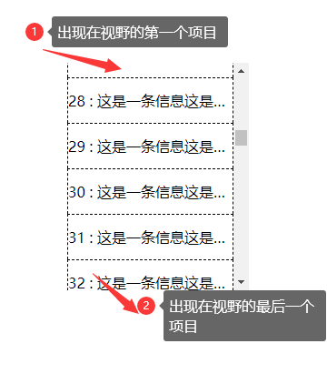
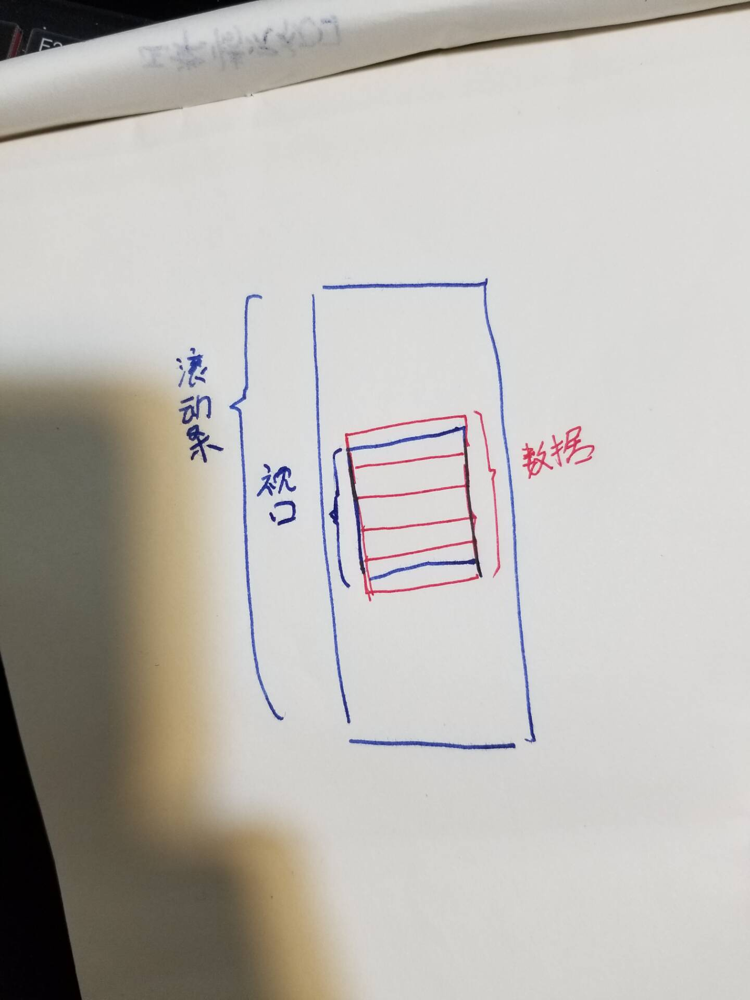
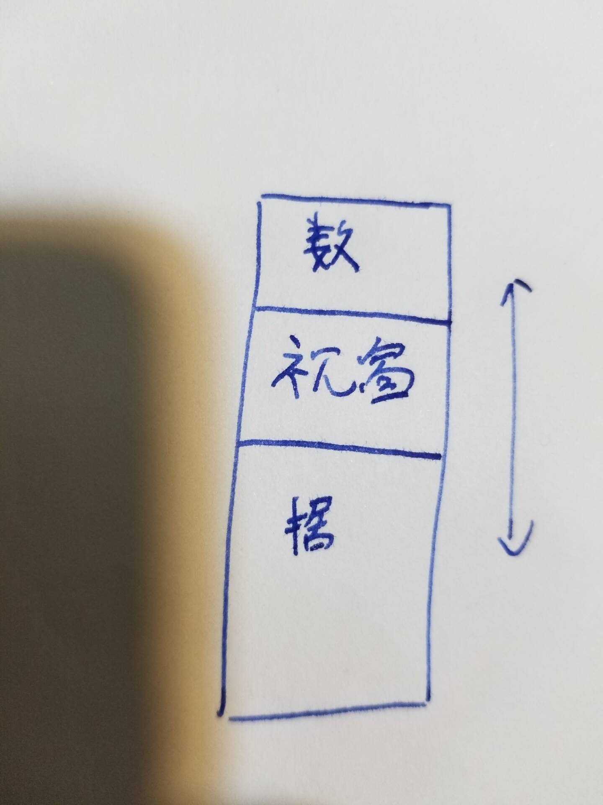
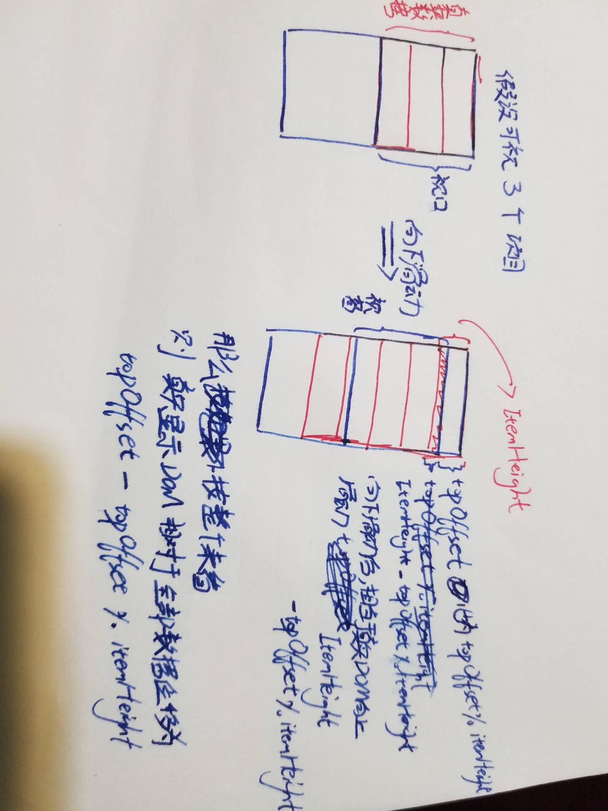

# 虚拟滚动

当我们要在某个页面上直接渲染大量数据时，浏览器一次加载过多的数据肯定会造成渲染问题，导致响应缓慢，影响用户体验。

针对单个页面上大量数据的渲染，我们可以使用虚拟滚动的方式，这里我们会提供一个数据长度的滚动条，仅在用户实际能看到的窗口中，才对滚动条对应部分的内容进行渲染。

## 简单实现原理——项目等高

抛开常理，设想一下当我们滚动一个滚动条时，在其窗口内，仅有部分数据可见，当我们见到的这部分数据时，我们大致能估计出它的位置：


那么这时我们该怎么来实现这种情况呢？

首先我们用以下DOM结构

```html
<div class="rolling_container">
    <div class="rolling_scroll-bar"></div>
    <div class="rolling_items">
        <div class="rolling_items-item ellipsis"></div>
    </div>
</div>
```

在这里`.rolling_container`作为我们承载数据的容器也即我们的视口；`.rolling_scroll-bar`作为一个替代真实数据高度的块，用来撑起滚动条，这个块的高度即所有数据的总高度；`.rolling_items`则为我们真实渲染的数据，即要在视口展示的，总体说它可能会像图中这样：


其中红色标色我们真实渲染的数据视图，中间的框表示视窗，外层表示真实数据的高度。

假设：

- 当前每个项目高度为`itemHeight`
- 当前数组总的数组为`listItems`，它们每个都有一个标号`uuid`，表示它们在当前数组的位置
- 当前可视区域显示完整项目数量为`visibleNum`
- 要进行渲染的数据存在的数组为`renderItems`
- 当前出现在视野中的第一个项目坐标为`startIndex`
- 当前出现在视野中的最后一个项目坐标为`endIndex`

首先你要知道当一个元素出现滚动条时，其`el.scrollTop`的值表示其滚动条上方隐藏内容的高度，这里我们简称为`topOffset`

因为这里是每个项目是等高的，所以我们可以计算出当前应该出现在视野的第一个项目`startIndex`的下标为`Math.floor(topOffset / itemHeight)`；当前应该出现在视野的最后一个项目的下标为`startIndex + visibleNum`(这里其实存在两种情况但是不影响)。

计算出两个坐标那么我们就知道了具体要渲染哪些项目了，即`renderItems = this.listItems.slice(this.startIndex, this.endIndex + 1);`(这里要多渲染一些，防止滑动到下面时，出现空白)

### 计算相对位移

现在想象一下一个滚动条滑动的过程，它具体是怎么动的，是不是相当于数据没动，只是视窗在数据的某个部分上移动：


那么对于我们的结构该怎么来实现呢，首先做到我们渲染的数据同步跟随视窗移动，此时的效果就是数据随着滑动并没有移动。那么要做出滑动的效果，就要计算出它们直接的相对位移，这里举一个最简单的情况:


现在先无视我们真实渲染的`DOM`，将后面整个滚动条高度看做全是数据铺垫而成的，那么由图中我们可以知道，**当向下滑动滚动条时`topOffset`距离时，相当于真实数据的第一行向上移动了`topOffset % itemHeight`(这里请注意图中因为我拿的是第一行举例，所以会产生歧义，移动的距离恰好等于`topOffset`)，那么图中阴影部分为`itemHeight - topOffset % itemHeight`，即我们的真实`DOM`其实向下移动的距离就为`topOffset - topOffset % itemHeight`(因为上述的`itemHeight`其实就为`topOffset - 之前所有的完整的项的高度`)**。

所以真实`DOM`相对于滚动条视图的位移为`topOffset - topOffset % itemHeight`，再仔细看一下就会发现，即**视图中第一个项目`DOM`节点的上顶在滚动条视图中的位置**。

具体代码实现：[等高虚拟列表](../../src/components/demo1/virtual-rolling-fixed.vue)

## 高级版本原理——不定高度

从简单版本我们就可以知道具体的相对位移了，但具体针对不定高度，我们该怎么来确定滚动条高度了，这里我们可以先假设单个项目的高度来计算总高度，待真正在`DOM`中渲染时，在将其真实的高度替换过去，理所当然，我们这时需要有一个来存储它们位置信息的对象，用它来存储每个项目的顶部位置，高度和下底位置。

同样，假设：

- 假定每个项目高度为`estimatedItemHeight`
- 项目总高度为`listTotalHeight`
- 假设一个位置信息集合对象`positionInfo`
- 要进行渲染的数据存在的数组为`renderItems`
- 当前出现在视野中的第一个项目坐标为`startIndex`
- 当前出现在视野中的最后一个项目坐标为`endIndex`

由于高度不等，所以我们不能在设置视窗内可显示的完整高度了，代替它我们设置一个视窗大小：

- 视窗大小为`visibleView`

这次我们计算`startIndex`等内容的过程比较不同，因为我们不知道项目的高度了，我们必须依靠位置信息对象`positionInfo`，它的每个元素应该是这样的：

```js
const positionInfo = {
    uuid: index,
    top: 0,
    height: 50,
    bottom: 100
}
```

其中所有位置信息都是相对于整个滚动条视图的，所以`top`表示其上顶距离滚动条视图顶部的位置；`bottom`表示其下底距离滚动条视图顶部的位置，这个位置也即是下一个`DOM`元素`top`的位置。

所以，`startIndex`为第一个`el.bottom`大于`topOffset`的元素；`endIndex`为第一个`el.bottom`大于`topOffset + visibleView`的位置，渲染项目即`renderItems = this.listItems.slice(this.startIndex, this.endIndex + 1);`，所以真实DOM相对于滚动条的位移为`positionInfo[startIndex].top;`

项目总高度`listTotalHeight`为`positionInfo[positionInfo.length - 1].bottom`，这样我们就可以简单的对数据进行渲染了，但是数据的高度还不是其真实高度，而是我们假定的。

### 更新真实位置信息

为了获得每个项目的真实的位置信息，我们需要在其渲染后进行获取，则需要在`updated`生命周期函数中调用更新方法。

此时我们调用`el.getBoundingClientRect()`来获取数据的具体高度，获取之后就要根据其对应的位置信息对象去更新其位置信息。由于每次渲染6个元素，更新位置信息是按序的，所以在更新当前元素高度`height`后，也要更新当前元素的`bottom`，这个`bottom`将作为下一个元素的`top`，以此类推；当前渲染的元素的位置信息更新完毕后，我们还需要同步更新那些未渲染的元素的位置信息，防止出现断层。

这样我们的实现基本上就完成了。

## 优化

1. 对于位置信息，我们只更新一次，更新后便缓存在`positionInfo`中并打上一个标记位，下次使用时检查该标记位，有则直接取出即可。

2. 在更新节点时，我们每更新一个节点就要更新剩下节点的信息，我们可以将整组当前渲染的信息更新完后，在一同更新剩下节点的信息。

3. 查找满足条件的DOM节点，在找寻`startIndex/endIndex`过程中，我们对其满足要求的位置信息对象有个查找过程，由于其是有序的数组，所以在不支持原生`Array.prototype.find()`方法时，使用二分法来查找。

4. 由于我们渲染的数目仅显示在视图中的几个，这就导致如果用户快速滑动时，会存在白屏的现象，那么我们在其前后多渲染几个项目，来作为缓冲。

## 问题

1. 在用户快速进行滑动（超快）时，会出现一个问题，那就是其跳过了中间某些元素的渲染，这就导致了连续的元素的`top`、`bottom`信息之间出现断层，所以我们要在每次渲染时，检查一下当前渲染的这组节点的第一个节点的前一个节点，是否存在断层，有那么使用上一个节点的`bottom`作为更新的起点。

2. 快速滑动时存在白屏(参考上面优化4)
